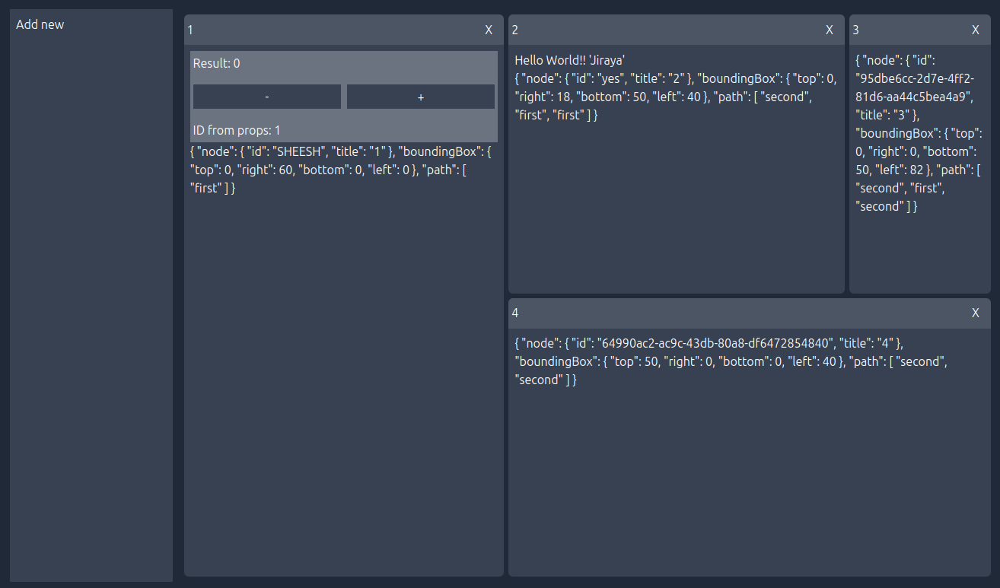

# Vue Mosaic

Vue Mosaic is a Tiling Window Manager for Vue 3. It provides a flexible API to tile arbitrarily complex Vue components across a user's view, with support for drag-and-drop reordering and resizable panes.

Based on [react-mosaic](https://github.com/nomcopter/react-mosaic).

